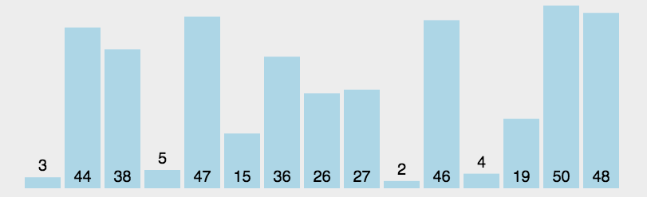
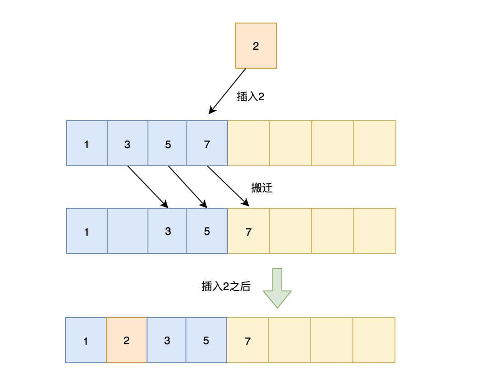

<Boxx changeTime="30000"/>

### 冒泡排序
:::tip 原理
从左往右，相邻比较，如果前一个大于后一个（正序，倒序相反），则交换，一轮下来最大值就在最右边了，一轮轮之后就完成了排序
:::
#### 图示

#### 代码
```js
function bubbleSort(arr) {
    for (let i = 0; i < arr.length; i++) {
        for (let j = 0; j < arr.length - i - 1; j++) {
            if (arr[j] > arr[j + 1]) {
                const temp = arr[j];
                arr[j] = arr[j + 1];
                arr[j + 1] = temp;
            }
        }
    }
}

// 改进冒泡排序
function bubbleSortImprove(arr) {
    for (let i = 0; i < arr.length; i++) {
        // 提前退出冒泡循环的标识位
        let flag = false;
        for (let j = 0; j < arr.length - i - 1; j++) {
            if (arr[j] > arr[j + 1]) {
                const temp = arr[j];
                arr[j] = arr[j + 1];
                arr[j + 1] = temp;
                flag = true;
                // 表示发生了数据交换
            }
        }
        // 没有数据交换
        if(!flag) break
    }
}


// 测试
let arr = [1, 3, 2, 5, 4]
bubbleSort(arr)
console.log(arr) // [1, 2, 3, 4, 5]

let arr1 = [1, 3, 2, 5, 4]
bubbleSortImprove(arr1)
console.log(arr1) // [1, 2, 3, 4, 5]
```
#### 复杂度
- **时间复杂度**：最好时间复杂度 `O(n)`，平均时间复杂度 `O(n^2^)`
- **空间复杂度**：`O(1)`

### 选择排序
:::tip 原理
从未排序的序列中找到最大（或最小的）放在已排序序列的末尾（为空则放在起始位置），重复该操作，知道所有数据都已放入已排序序列中
:::
#### 图示

#### 代码
```js
function selectionSort(arr) {
  let length = arr.length,
      indexMin
  for(let i = 0; i < length - 1; i++) {
    indexMin = i
    for(let j = i; j < length; j++) {
      if(arr[indexMin] > arr[j]) {
        indexMin = j
      }
    }
    if(i !== indexMin) {
      let temp = arr[i]
      arr[i] = arr[indexMin]
      arr[indexMin] = temp
    }
  }
}

// 测试
let arr = [1, 3, 2, 5, 4]
selectionSort(arr)
console.log(arr) // [1, 2, 3, 4, 5]
```
#### 复杂度
- **时间复杂度**：`O(n^2)`
- **空间复杂度**：`O(1)`

### 归并排序
:::tip 原理
采用了分治策略，将数组分成2个较小的数组，然后每个数组再分成两个更小的数组，直至每个数组里只包含一个元素，然后将小数组不断的合并成较大的数组，直至只剩下一个数组，就是排序完成后的数组序列

步骤：
- 将原始序列平分成两个小数组
- 判断小数组长度是否为1，不为1则继续分裂
- 原始数组被分称了长度为1的多个小数组，然后合并相邻小数组（有序合并）
- 不断合并小数组，直到合并称一个数组，则为排序后的数组序列
:::
#### 图示

#### 代码
```js
function mergeSort(arr) {
  return mergeSortRec(arr)
}

// 若分裂后的两个数组长度不为 1，则继续分裂
// 直到分裂后的数组长度都为 1，
// 然后合并小数组
function mergeSortRec(arr) {
  let length = arr.length
  if(length === 1) {
    return arr
  }
  let mid = Math.floor(length / 2),
      left = arr.slice(0, mid),
      right = arr.slice(mid, length)
  return merge(mergeSortRec(left), mergeSortRec(right))
}

// 顺序合并两个小数组left、right 到 result
function merge(left, right) {
  let result = [],
      ileft = 0,
      iright = 0
  while(ileft < left.length && iright < right.length) {
    if(left[ileft] < right[iright]){
      result.push(left[ileft ++])
    } else {
      result.push(right[iright ++])
    }
  }
  while(ileft < left.length) {
    result.push(left[ileft ++])
  }
  while(iright < right.length) {
    result.push(right[iright ++])
  }
  return result
}

let arr = [1, 3, 2, 5, 4]
console.log(mergeSort(arr)) // [1, 2, 3, 4, 5]
```
#### 复杂度
- **时间复杂度**：`O(nlog~2n)`
- **空间复杂度**：`O(n)`


### 快速排序
:::tip 原理
和归并排序一致，它也使用了分治策略的思想，它也将数组分成一个个小数组，但与归并不同的是，它实际上并没有将它们分隔开。

快排使用了分治策略的思想，所谓分治，顾名思义，就是分而治之，将一个复杂的问题，分成两个或多个相似的子问题，在把子问题分成更小的子问题，直到更小的子问题可以简单求解，求解子问题，则原问题的解则为子问题解的合并。

快排的过程简单的说只有三步：
- 首先从序列中选取一个数作为基准数
- 将比这个数大的数全部放到它的右边，把小于或者等于它的数全部放到它的左边 （一次快排 `partition`）
- 然后分别对基准的左右两边重复以上的操作，直到数组完全排序
:::

#### 具体按以下步骤实现：

1. 创建两个指针分别指向数组的最左端以及最右端
2. 在数组中任意取出一个元素作为基准
3. 左指针开始向右移动，遇到比基准大的停止
4. 右指针开始向左移动，遇到比基准小的元素停止，交换左右指针所指向的元素
5. 重复`3，4`，直到左指针超过右指针，此时，比基准小的值就都会放在基准的左边，比基准大的值会出现在基准的右边
6. 然后分别对基准的左右两边重复以上的操作，直到数组完全排序

:::warning 注意
如何选择基准该如何？

最简单的一种做法是每次都是选择最左边的元素作为基准

但这对几乎已经有序的序列来说，并不是最好的选择，它将会导致算法的最坏表现。还有一种做法，就是选择中间的数或通过 `Math.random()` 来随机选取一个数作为基准，下面的代码实现就是以随机数作为基准。
:::

#### 图示


#### 代码
```js
let quickSort = (arr) => {
  quick(arr, 0 , arr.length - 1)
}

let quick = (arr, left, right) => {
  let index
  if(left < right) {
    // 划分数组
    index = partition(arr, left, right)
    if(left < index - 1) {
      quick(arr, left, index - 1)
    }
    if(index < right) {
      quick(arr, index, right)
    }
  }
}

// 一次快排
let partition = (arr, left, right) => {
  // 取中间项为基准
  var datum = arr[Math.floor(Math.random() * (right - left + 1)) + left],
      i = left,
      j = right
  // 开始调整
  while(i <= j) {
    
    // 左指针右移
    while(arr[i] < datum) {
      i++
    }
    
    // 右指针左移
    while(arr[j] > datum) {
      j--
    }
    
    // 交换
    if(i <= j) {
      swap(arr, i, j)
      i += 1
      j -= 1
    }
  }
  return i
}

// 交换
let swap = (arr, i , j) => {
    let temp = arr[i]
    arr[i] = arr[j]
    arr[j] = temp
}

// 测试
let arr = [1, 3, 2, 5, 4]
quickSort(arr)
console.log(arr) // [1, 2, 3, 4, 5]
// 第 2 个最大值
console.log(arr[arr.length - 2])  // 4
```

快排是从小到大排序，所以第 `k` 个最大值在 `n-k` 位置上

#### 复杂度
- **时间复杂度**：`O(nlog~2~n)`
- **空间复杂度**：`O(nlog~2~n)`

### 插入排序
插入排序的工作原理是通过构建有序序列，对于未排序数据，在已排序序列中从后向前扫描，找到相应位置并插入

#### 图示


#### 代码
```js
function insertionSort(arr) {
    let n = arr.length;
    let preIndex, current;
    for (let i = 1; i < n; i++) {
        preIndex = i - 1;
        current = arr[i];
        while (preIndex >= 0 && arr[preIndex] > current) {
            arr[preIndex + 1] = arr[preIndex];
            preIndex--;
        }
        arr[preIndex + 1] = current;
    }
    return arr;
}
```
插入算法的核心思想是取未排序区间中的元素，在已排序区间中找到合适的插入位置将其插入，并保证已排序区间数据一直有序。重复这个过程，直到未排序区间中元素为空，算法结束。

#### 复杂度：
- **时间复杂度**：`O(n^2^)`
- **空间复杂度**：`O(1)`

### 希尔排序
1959年Shell发明，第一个突破 O(n^2^) 的排序算法，是简单插入排序的改进版。它与插入排序的不同之处在于，它会优先比较距离较远的元素。

上面的插入排序：
- 第一趟插入排序后，我们得到的有效序列长度为 2
- 第二趟插入排序后，我们得到的有效序列长度为 3
- ...
- 直到这个序列有序

所以，如果序列足够乱的话，时间复杂度为 `O(n^2^)`

希尔排序又叫`缩小增量排序`，就是把数列进行分组(组内不停使用插入排序)，直至从宏观上看起来有序，最后插入排序起来就容易了(无须多次移位或交换)。

其中组的数量称为 `增量` ，显然的是，增量是不断递减的(直到增量为1)

**如何进行分组？**

如果一个数列有 8 个元素，我们第一趟的增量是 4 ，第二趟的增量是 2 ，第三趟的增量是 1 。如果一个数列有 18 个元素，我们第一趟的增量是 9 ，第二趟的增量是 4 ，第三趟的增量是2 ，第四趟的增量是 1

很明显我们可以用一个序列来表示增量：`n/2`、`(n/2)/2`、...、`1`，每次增量都`/2`

```js
let arr = [4, 1, 5, 8, 7, 3]
```

**排序前**
- 将该数组看成三组 `Math.floor(arr.length/2)`，分别是： `[4, 1]` ， `[5, 8]` ， `[7, 3]`

**第一次排序**
- 对三组数据分别进行插入排序，因此我们三个数组得到的结果为： `[1, 4]` ， `[5, 8]` ， `[3, 7]`

**第二次排序**
- 增量减少了，上面增量是 `3`，此时增量应该为 `1` 了，因此把 `[1, 4, 5, 8, 3, 7]` 看成一个数组(**宏观上是有序**)，对其进行插入排序，**直至有序**

#### 代码实现
```js
function shellSort(arr) {
    let n = arr.length;
    for (let gap = Math.floor(n / 2); gap > 0; gap = Math.floor(gap / 2)) {
        for (let i = gap; i < n; i++) {
            let j = i;
            let current = arr[i];
            while (j - gap >= 0 && current < arr[j - gap]) {
                 arr[j] = arr[j - gap];
                 j = j - gap;
            }
            arr[j] = current;
        }
    }
    return arr;
}
```
#### 复杂度
- **时间复杂度**：`O(nlogn)`
- **空间复杂度**：`O(1)`

### 计数排序
:::tip 原理
计数排序不是基于比较的排序算法，其核心在于将输入的数据值转化为键存储在额外开辟的数组空间中。

作为一种线性时间复杂度的排序，计数排序要求输入的数据必须是有确定范围的整数。它是一种典型的拿空间换时间的排序算法。
:::

#### 图示


#### 代码
```js
function countingSort(arr, maxValue) => {
    // 开辟的新的数组，用于将输入的数据值转化为键存储
    var bucket = new Array(maxValue + 1),
        sortedIndex = 0,
        arrLen = arr.length,
        bucketLen = maxValue + 1

    // 存储
    for (var i = 0; i < arrLen; i++) {
        if (!bucket[arr[i]]) {
            bucket[arr[i]] = 0
        }
        bucket[arr[i]]++
    }

    // 将数据从bucket按顺序写入arr中
    for (var j = 0; j < bucketLen; j++) {
        while(bucket[j]-- > 0) {
            arr[sortedIndex++] = j
        }
    }
    return arr
}
```
#### 复杂度
- **时间复杂度**：`O(n+k)`
- **空间复杂度**：`O(n+k)`

### 桶排序
:::tip 原理
桶排序是计数排序的升级版。它也是利用函数的映射关系。

**桶排序 (Bucket sort)**的工作的原理：假设输入数据服从均匀分布，将数据分到有限数量的桶里，每个桶再分别排序（有可能再使用别的排序算法或是以递归方式继续使用桶排序进行排）。

**步骤**：
- 首先使用 `arr` 来存储频率
- 然后创建一个数组（有数量的桶），将频率作为数组下标，对于出现频率不同的数字集合，存入对应的数组下标（桶内）即可
:::

#### 代码
```js
// 桶排序
let bucketSort = (arr) => {
    let bucket = [], res = []
    arr.forEach((value, key) => {
        // 利用映射关系（出现频率作为下标）将数据分配到各个桶中
        if(!bucket[value]) {
            bucket[value] = [key]
        } else {
            bucket[value].push(key)
        }
    })
    // 遍历获取出现频率
    for(let i = 0;i <= bucket.length - 1;i++){
        if(bucket[i]) {
            res.push(...bucket[i])
        }
 }
 return res
}
```

#### 复杂度
- **时间复杂度**：`O(n)`
- **空间复杂度**：`O(n)`

### 基数排序
:::tip 原理
基数排序是一种非比较型整数排序算法，其原理是将整数按位数切割成不同的数字，然后按每个位数分别比较。由于整数也可以表达字符串（比如名字或日期）和特定格式的浮点数，所以基数排序也不是只能使用于整数。

**步骤**：
- 取得数组中的最大数，并取得位数
- `arr` 为原始数组，从最低位开始取每个位组成`radix`数组
- 对`radix`进行计数排序（利用计数排序适用于小范围数的特点）
:::

#### 图示


#### 代码
```js
//LSD Radix Sort
var counter = [];
function radixSort(arr, maxDigit) {
    var mod = 10;
    var dev = 1;
    for (var i = 0; i < maxDigit; i++, dev *= 10, mod *= 10) {
        for(var j = 0; j < arr.length; j++) {
            var bucket = parseInt((arr[j] % mod) / dev);
            if(counter[bucket]==null) {
                counter[bucket] = [];
            }
            counter[bucket].push(arr[j]);
        }
        var pos = 0;
        for(var j = 0; j < counter.length; j++) {
            var value = null;
            if(counter[j]!=null) {
                while ((value = counter[j].shift()) != null) {
                      arr[pos++] = value;
                }
          }
        }
    }
    return arr;
}
```

#### 复杂度
- **时间复杂度**：基数排序基于分别排序，分别收集，所以是稳定的。但基数排序的性能比桶排序要略差，每一次关键字的桶分配都需要`O(n)`的时间复杂度，而且分配之后得到新的关键字序列又需要`O(n)`的时间复杂度。假如待排数据可以分为 `d` 个关键字，则基数排序的时间复杂度将是`O(d*2n)` ，当然d要远远小于`n`，因此基本上还是线性级别的
- **空间复杂度**：`O(n+k)`，其中k为桶的数量。一般来说 `n>>k`，因此额外空间需要大概 `n` 个左右

### 基数排序 vs 计数排序 vs 桶排序
这三种排序算法都利用了桶的概念，但对桶的使用方法上有明显差异：

- **基数排序**：根据键值的每位数字来分配桶；
- **计数排序**：每个桶只存储单一键值；
- **桶排序**：每个桶存储一定范围的数值；

### 堆排序
:::tip 原理
堆是一棵完全二叉树，它可以使用数组存储，并且大顶堆的最大值存储在根节点（i=1），所以我们可以每次取大顶堆的根结点与堆的最后一个节点交换，此时最大值放入了有效序列的最后一位，并且有效序列减1，有效堆依然保持完全二叉树的结构，然后堆化，成为新的大顶堆，重复此操作，知道有效堆的长度为 0，排序完成。

步骤为：
- 将原序列（n个）转化成一个大顶堆
- 设置堆的有效序列长度为 n
- 将堆顶元素（第一个有效序列）与最后一个子元素（最后一个有效序列）交换，并有效序列长度减1
- 堆化有效序列，使有效序列重新称为一个大顶堆
- 重复以上2步，直到有效序列的长度为 1，排序完成
:::

#### 图示


#### 代码
```js
function heapSort(items) {
    // 构建大顶堆
    buildHeap(items, items.length-1)
    // 设置堆的初始有效序列长度为 items.length - 1
    let heapSize = items.length - 1
    for (var i = items.length - 1; i > 1; i--) {
        // 交换堆顶元素与最后一个有效子元素
        swap(items, 1, i);
        // 有效序列长度减 1
        heapSize --;
        // 堆化有效序列(有效序列长度为 currentHeapSize，抛除了最后一个元素)
        heapify(items, heapSize, 1);
    }
    return items;
}

// 原地建堆
// items: 原始序列
// heapSize: 有效序列长度
function buildHeap(items, heapSize) {
    // 从最后一个非叶子节点开始，自上而下式堆化
    for (let i = Math.floor(heapSize/2); i >= 1; --i) {    
        heapify(items, heapSize, i);  
    }
}
function heapify(items, heapSize, i) {
    // 自上而下式堆化
    while (true) {
        var maxIndex = i;
        if(2*i <= heapSize && items[i] < items[i*2] ) {
            maxIndex = i*2;
        }
        if(2*i+1 <= heapSize && items[maxIndex] < items[i*2+1] ) {
            maxIndex = i*2+1;
        }
        if (maxIndex === i) break;
        swap(items, i, maxIndex); // 交换 
        i = maxIndex; 
    }
}  
function swap(items, i, j) {
    let temp = items[i]
    items[i] = items[j]
    items[j] = temp
}

// 测试
var items = [,1, 9, 2, 8, 3, 7, 4, 6, 5]
heapSort(items)
// [empty, 1, 2, 3, 4, 5, 6, 7, 8, 9]
```

#### 复杂度
- **时间复杂度**：建堆过程的时间复杂度是 `O(n)` ，排序过程的时间复杂度是 `O(nlogn)` ，整体时间复杂度是 `O(nlogn)`
- **空间复杂度**：`O(1)`
