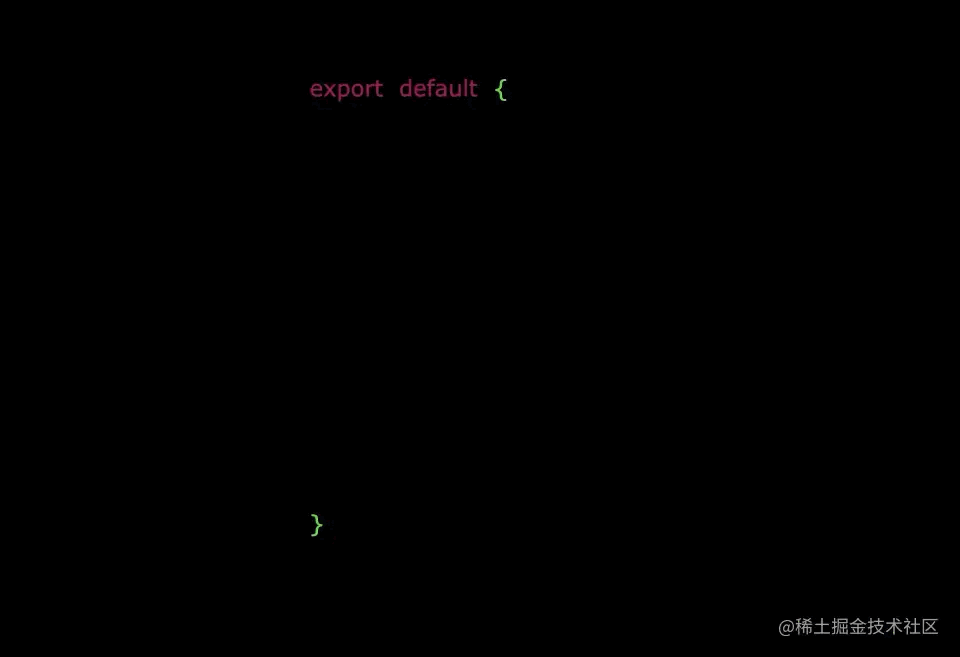
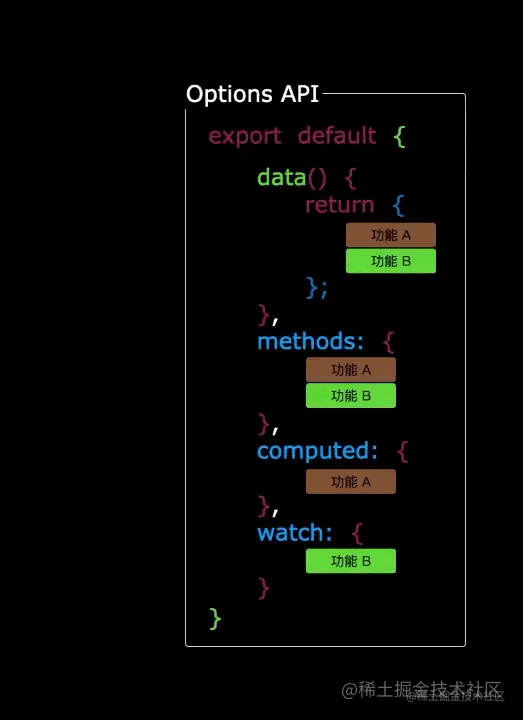
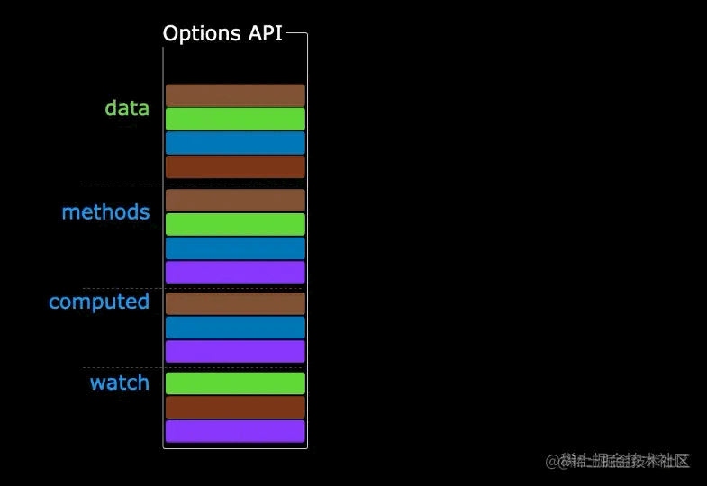

<Boxx changeTime="30000"/>

:::tip 背景
对于组合式API官方的解释是：在 `Vue` 应用的概念中，`组合式函数(Composables)` 是一个利用 `Vue` 的组合式 `API` 来封装和复用有状态逻辑的函数。

但是官方并没有对自定义`Hooks`做任何描述（🐶），只是很自然的使用这个写法，很多开源项目也在推崇这个写法。
所以对于我们学习者来说，学习[组合式API](https://cn.vuejs.org/guide/extras/composition-api-faq.html)是一个很好的方向。

ps：文档只阴阳了一波 [React Hooks](https://cn.vuejs.org/guide/extras/composition-api-faq.html#comparison-with-react-hooks)。
:::

<!-- more -->

## 什么是`Hooks`？
`hooks` 直译是 `钩子`，它并不仅是 `react`，甚至不仅是前端界的专用术语，而是整个行业所熟知的用语。通常指：系统运行到某一时期时，会调用被注册到该时机的回调函数。

## Hooks的优点
### 更好的状态复用
**假设有如下需求：**

当组件实例创建时，需要创建一个 `state` 属性：`name`，并随机给此 `name` 属性赋值一个初始值。除此之外，还得提供一个 `setName` 方法。你可以在组件其他地方开销和修改此状态属性。

**更重要的是:** 这个逻辑要可以复用，在各种业务组件里复用这个逻辑。

在拥有 `Hooks` 之前，我首先会想到的解决方案一定是 `mixin`。
```js
// user-mixin.js
export default {
  data() {
    return {
      name: '张三'
    }
  },
  methods: {
    setName(name) {
      this.name = name
    }
  }
}
```
```vue
// 组件：my-component.vue
<template>
  <div>{{ name }}</div>
<template>

<script>
import nameMixin from './name-mixin';

export default {
  mixins: [nameMixin],
  mounted() {
    setTimeout(() => {
      this.setName('Sanm')
    }, 2333)
  }
}
</script>
```
- 看起来好像是可以复用,但是不推荐，因为 `React` 官方出来说话了。
:::warning 注意
`ES6`本身是不包含任何`mixin`支持。因此，当你在`......`

**结论：** 不建议在新代码中使用它们。[👉](https://zh-hans.react.dev/community/versioning-policy#commitment-to-stability)

同时 `Vue3` 也更推荐使用组合式API，而不是 `mixin`。[👉](https://cn.vuejs.org/api/options-composition.html#mixins)
:::
**方法/属性难监听**
```js
export default {
  mixins: [ a, b, c, d ],
  mounted() {
    console.log(this.name)
  }
}
```
> `this.name`🙃🙃🙃 我生从何来，死往何处，我为何要出现在这个世界上，我的出现对这个世界来说意味着什么，是世界选择了我，还是我选择了世界？

**方法/属性会覆盖**<br>
同时想混入 `a-mixin.js` 和 `b-mixin.js` 时，可能会遇到比较尴尬的事情：由于这两个 `mixin` 不同人员开发，都定义了 `this.name` 作为属性，就容易出现问题。

### 更好的代码结构
众所周知，图片不会动，所以动图都是真的。




:::tip 说明
上图是`Vue2`的`Option API`的写法，组件下可能含有`data` 、`methos`、`computed`等等一些选项，一旦功能多了没有及时拆分看起来不会很直观，毕竟需要来回切换。

下图是`Vue3`的`Composition API`，可以将逻辑聚合在一起，如果再结合自定义`Hooks`，那会是组件的逻辑路口更加清晰。

> 图为[大帅老袁](https://juejin.cn/post/6890545920883032071)老师做的，感谢！！！
:::



🐶难道这就是传说中的 **`高内聚，低耦合`**

## `Vue3`的自定义`Hooks`
- 将可复用的功能抽离为外部`JS`文件
- 函数名/文件名以`use`开头，形如`useXXXX`
- 引用时将响应式变量或者方法显式解构暴露出来

```js
const { nameRef, Fn } = useXX()
```
> 推荐可以学习[`useVue`](https://www.vueusejs.com/)工具库中写法

### 工具/公共复用
**鼠标跟踪器示例**
```js
import { ref, onMounted, onUnmounted } from 'vue'

// 按照惯例，组合式函数名以“use”开头
export function useMouse() {
  // 被组合式函数封装和管理的状态
  const x = ref(0)
  const y = ref(0)

  // 组合式函数可以随时更改其状态。
  function update(event) {
    x.value = event.pageX
    y.value = event.pageY
  }

  // 一个组合式函数也可以挂靠在所属组件的生命周期上
  // 来启动和卸载副作用
  onMounted(() => window.addEventListener('mousemove', update))
  onUnmounted(() => window.removeEventListener('mousemove', update))

  // 通过返回值暴露所管理的状态
  return { x, y }
}
```
```vue
// 在vue中使用
<script setup>
import { useMouse } from './mouse.js'

const { x, y } = useMouse()
</script>

<template>Mouse position is at: {{ x }}, {{ y }}</template>
```
> [官方示例](https://cn.vuejs.org/guide/reusability/composables.html#mouse-tracker-example)

### 逻辑/业务拆分
```ts
// useUser.ts
import { computed, reactive, ref } from 'vue';
import { LoginForm, UseUserProps, UserInfo, UserStatus } from '@/views/login/LoginModel';

const user = ref<UserInfo>()

export const useUser = (): UseUserProps => {
  const userInit = () => {
    if (user.value?.status === UserStatus.REGISTER) {
      user.value = { status: UserStatus.OFFLINE }
    }
  }

  const loginForm = reactive<LoginForm>({
    username: '',
    password: ''
  })
  const login = async() => {
    user.value = { id: 1, name: loginForm.username, status: UserStatus.ONLINE }
    console.log('登录成功')
  }
  const logout = async() => {
    user.value = { status: UserStatus.OFFLINE }
    console.log('登出成功')
  }

  const registerForm = reactive<LoginForm>({
    username: '',
    password: ''
  })
  const register = async() => {
    user.value = { status: UserStatus.REGISTER }
    console.log('注册成功')
  }

  const userStatus = computed(() => {
    if (user.value?.status) {
      return user.value.status
    }
    return UserStatus.OFFLINE
  })

  return {
    userInit,
    loginForm,
    user,
    login,
    userStatus,
    logout,

    registerForm,
    register
  }
}
```
```vue
// 在vue中使用
// Login.vue
<script setup lang="ts">
import { onMounted } from 'vue'
import { useUser } from '@/compositions/useUser'
import { UserStatus } from '@/views/login/LoginModel'

// 抽离了useUser的代码
const { loginForm, user, logout, login, userStatus, userInit } = useUser()

onMounted(() => {
  userInit()
})
</script>

<template>
  <div class="form-cont login-cont" v-if="userStatus === UserStatus.OFFLINE">
    <div class="form-item">
      <label>用户名</label>
      <input type="text" v-model="loginForm.username" placeholder="请输入用户名" />
    </div>
    <div class="form-item">
      <label>密码</label>
      <input type="password" v-model="loginForm.password" placeholder="请输入密码" />
    </div>
    <div class="form-item">
      <a class="login-btn margin-left-18" @click.prevent="login">登录</a>
    </div>
  </div>
  <div class="logout-cont" v-if="userStatus === UserStatus.ONLINE">
    Wecome {{ user?.name }},
    <a class="logout-btn" @click.prevent="logout">Logout</a>
  </div>
</template>

<style scoped lang="scss">
.form-cont {
  display: flex;
  flex-direction: column;
  justify-content: center;
}
...
</style>
```
> [个人案例](https://sanm-zh.github.io/vue3-ts-vite/#/login)，tabs -> Login

## 个人总结
`Hooks`在`Vue`中，个人结合当前已知场景大致归为两种用途，其实`Hooks`只是一种写法，把它归类属实有些不严谨；但是结合`自身业务/场景`找出适合团队的方向，把它优雅的用起来快速落地应该才是大家迫切的想法。

祝大家在开发过程中分享出更为优雅的`Hooks`思路，毕竟我们只是代码的搬运工，`Coding`起来吧！